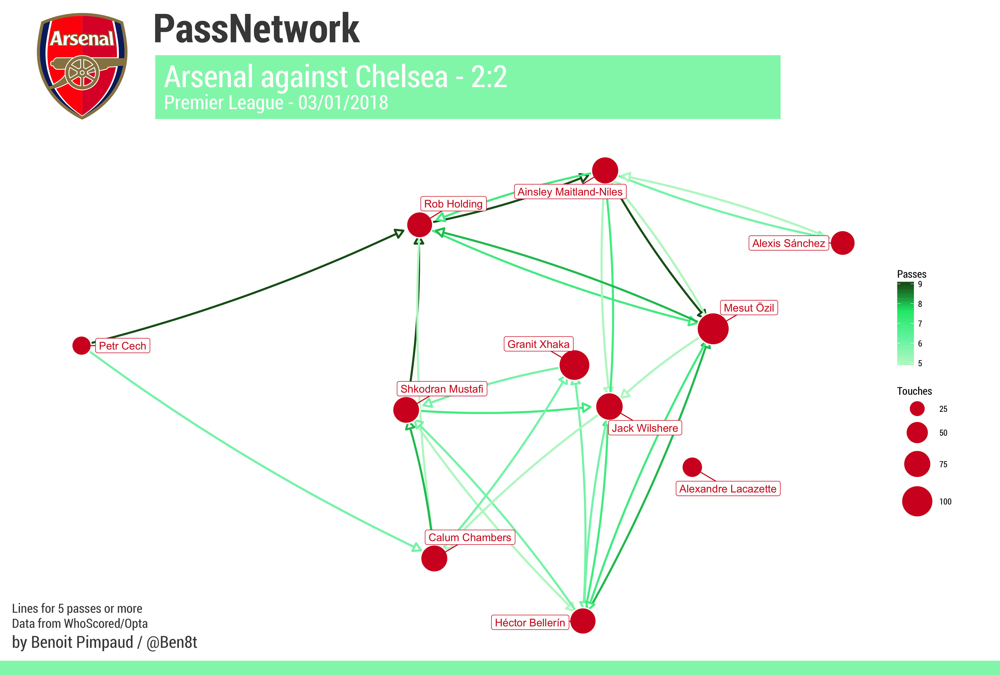

# Passnetwork with R
Create passnetwork thanks to data from WhoScored.com (Opta) in R with `igraph` and `ggnetwork` libraries. 

## Gather data from WhoScored
Get the match url directly from WhoScored (Match Centre link on a game webpage)

Example : https://www.whoscored.com/Matches/1190338/Live/England-Premier-League-2017-2018-Bournemouth-Arsenal

> **Note** : You can get data directly from WhoScored with copy-paste command below in your web navigator javascript console : 
`copy(JSON.stringify(matchCentreData));` 
This command put a json object in your clipboard that you can paste in a json file.

## PassNetwork builder
Run this command in a shell: 
`Rscript passNetwork.r "url" "path_to_save_data" "team" "color" pass_number`

* `url` is the WhoScored url we talk about above.
* `path_to_save_data` is the path you want to save your data
* `team` is either "home" or "away" (to select the team)
* `color` in HEX for player names and circles.
* `pass_number` the number of passes to draw one line (work sometimes better with 2 or 3 passes, especially when the team did not have possession of the ball).

**Example**: `Rscript passNetwork.r "https://www.whoscored.com/Matches/1190338/Live/England-Premier-League-2017-2018-Bournemouth-Arsenal" "data/arsenal1718" "away" "#90caf9" 5`

This command generate a `g_passnetwork_tmp.png` file (image file).

> **Note** : You will need some R packages

> * tidyverse
> * hrbrthemes
> * jsonlite
> * grid
> * gridExtra
> * igraph
> * ggnetwork

## Example (with some additions on Photoshop)

## What's next ?
* Add directly text features and team logo.
* Working on a website to directly create passnetwork with an user-friendly interface... #RShiny
