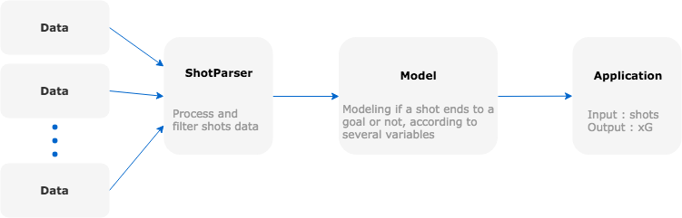

# Model

## Expected goal

Expected goals (xG) is the new revolutionary football metric, which allows you to evaluate team and player performance. 
In a low-scoring game such as football, final match score does not provide a clear picture of performance.
This is why more and more sports analytics turn to the advanced models like xG, which is a statistical measure of the quality of chances created and conceded.

Goal here is to create a simple model for shot quality evaluation. It can be improve with more data and more modelling.

## Expected assist

Expected assist (xA) are the same as expected goals but for passes. Each passe is evaluate according to its likelihood of being an assist.
