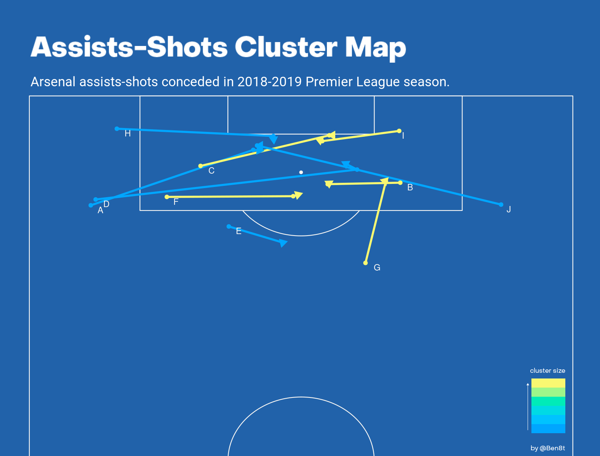
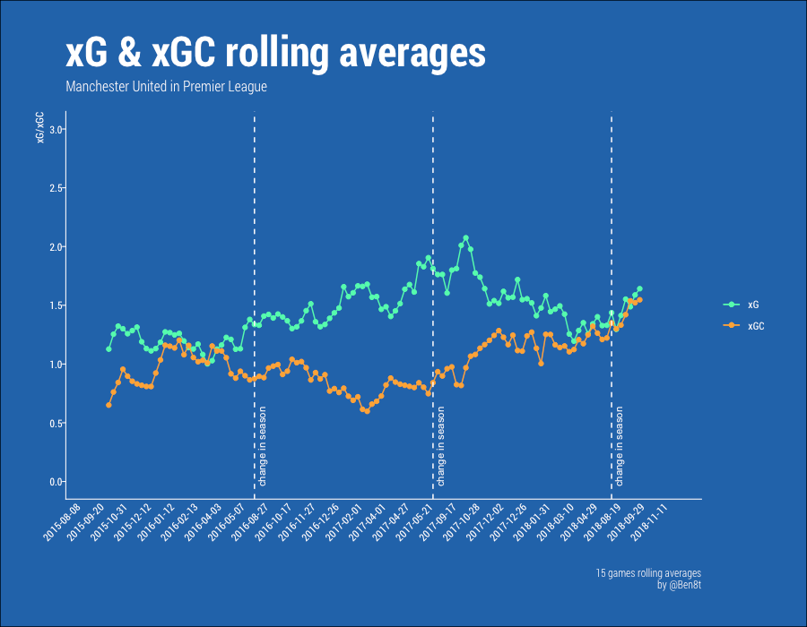
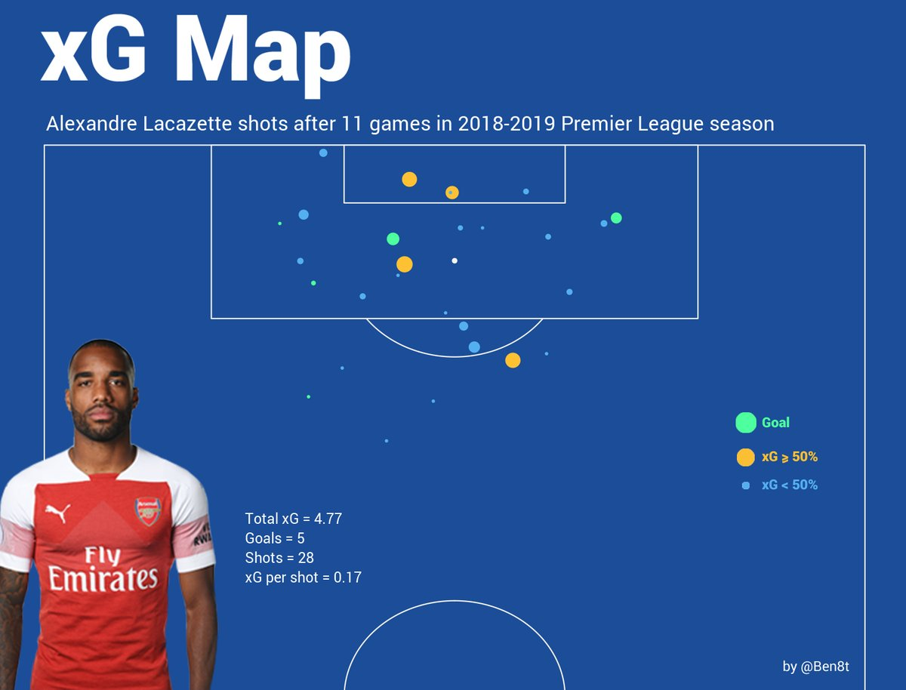
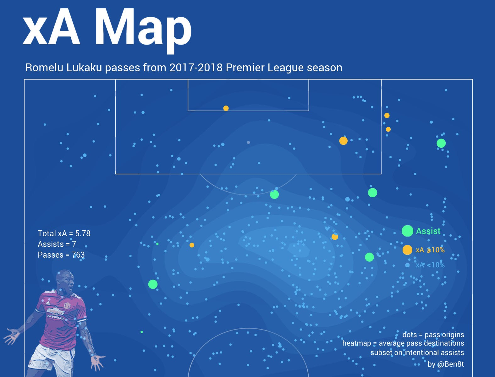
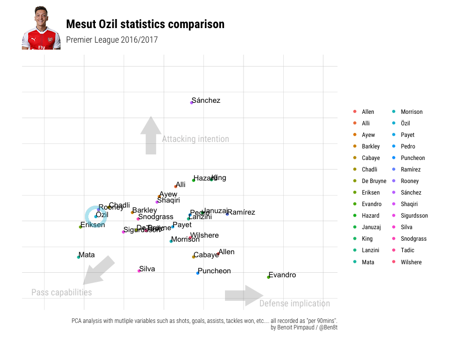
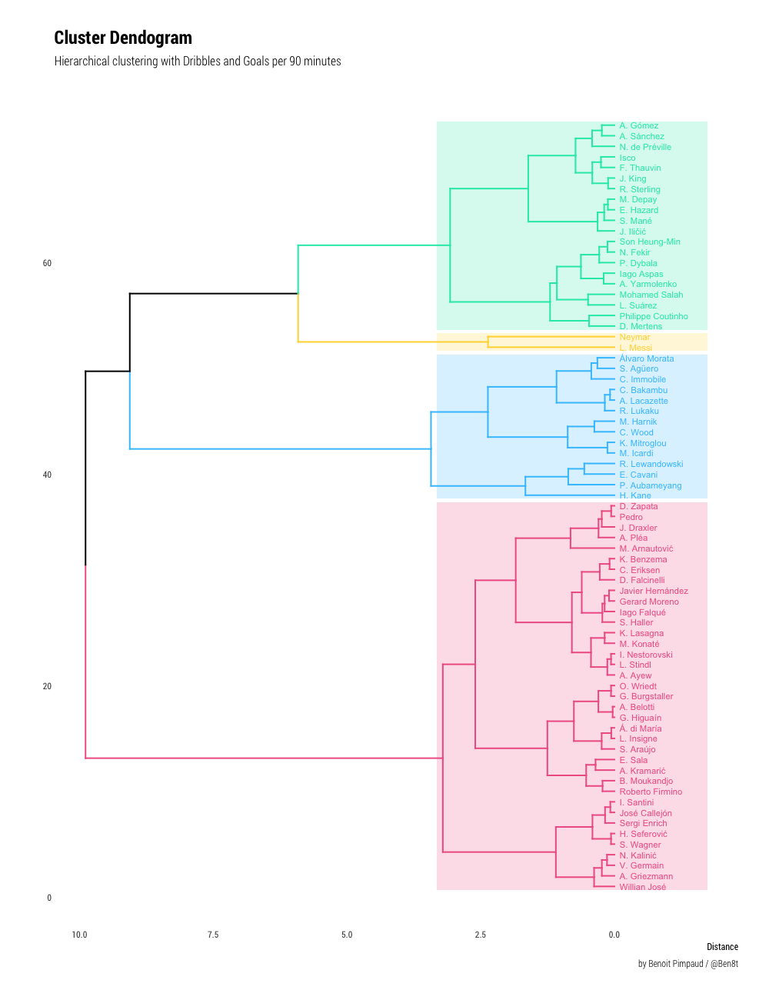

# Football Models and Visualisations

---

This repository is a personal project where I develop football models and visualisations.

It's build on top of different technologies such as:
* Python: for data processing and machine learning (Tensorflow, Scikit-Learn and MLFlow).
* R: all data-visualisation stuff (dplyr, ggplot2, magick).
* Postgres SQL: storing and querying data easily.
* Docker: to orchestrate all these elements together and easy install/startup.

## Samples & Results

## Architecture

The project contains five folders:

* `./app` : maybe deprecated design, mostly for data integration and easy of use.
* `./data`: where raw data are stored (in addition to the database). Not in git :wink:.
* `./model`: machine learning models (expected goal for example).
* `./src`: source file for crawlers, database connection/ingestion, SQL queries, etc...
* `./visualisation`: source code for data-visualization, most recent works (on maps) are in `./visualisation/maps` subfolders.

## TODO

* Improve models
* [WIP] Moving to [MLFlow](https://www.mlflow.org/docs/latest/index.html) for modelisation setup.

## Contacts
This folder is a kind of POC toolkit for me, so it is not necessarily clean. I try to keep things organized anyway. Any questions/improves on [Twitter @Ben8t](https://twitter.com/Ben8t).
