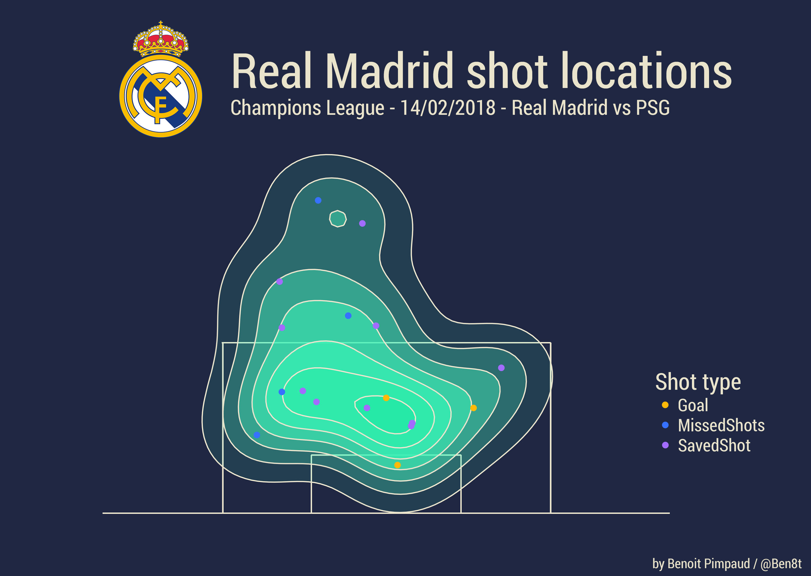

# Visualisation

This repository consist of data-visualization and some R scripts on football data.
Most of these works are developed in R, especially with :

* dplyr
* ggplot2
* rvest

and all the awesome tidyverse...

## More developed works

### Maps

### Lineup

Plot lineups evolution

### PCA

### Dendogram (hierarchical clustering)

### Others

There are also classic stuff like barchart or piechart...
